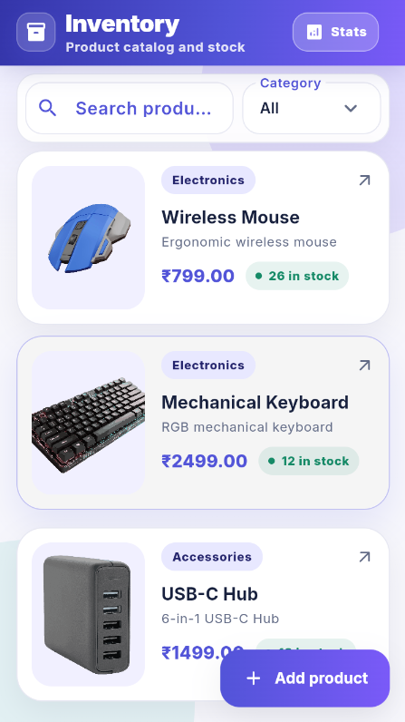
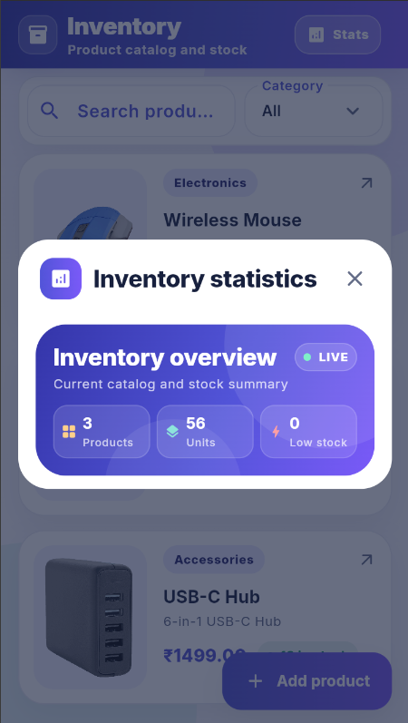
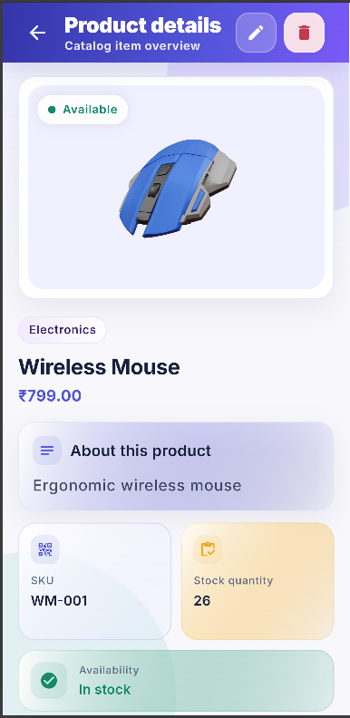
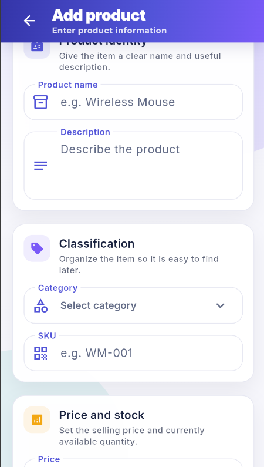
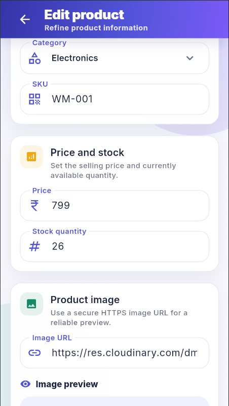

# Inventory Management App

A production-oriented Flutter inventory CRUD application built with Clean Architecture, BLoC state management, MockAPI integration, responsive UI, validation, and automated tests.

## Features

- Product listing with search and category filtering
- Add, edit, and delete product flows
- Product details page with stock, SKU, category, price, image, and availability
- Blocking inventory statistics dashboard
- Responsive phone, tablet, web, and desktop layouts
- HTTPS product image loading with fallback states
- Form validation and safe submit handling
- Centralized API, error handling, theme, and reusable UI components

## Screenshots

Screenshots are stored in `docs/screenshots/`.

### Home Product List



---

### Statistics Dashboard



---

### Product Details



---

### Add Product



---

### Edit Product



## Architecture

The project follows Clean Architecture with a feature-first folder structure. The UI does not call the API directly. User actions go through BLoC, then use cases, then repository abstractions, then the remote data source and API client.

```text
UI / Widgets
  -> InventoryBloc
  -> Use cases
  -> InventoryRepository
  -> InventoryRemoteDataSource
  -> ApiClient
  -> MockAPI
```

This keeps presentation, business logic, data mapping, and networking separated and easier to test.

## Folder Structure

```text
lib/
  app/
    app.dart
    layout/
    theme/
    widgets/
  core/
    constants/
    errors/
    network/
    utils/
  features/
    inventory/
      data/
        data_sources/
        models/
        repositories/
      domain/
        entities/
        repositories/
        use_cases/
      presentation/
        bloc/
        pages/
        utils/
        validation/
        widgets/
test/
  core/
  features/
  widget_test.dart
```

## MockAPI Configuration

The app uses this MockAPI base URL by default:

```text
https://6a5c494564f700df5bd7e300.mockapi.io/api/v1
```

The products endpoint is:

```text
https://6a5c494564f700df5bd7e300.mockapi.io/api/v1/products
```

The base URL is configured in:

```text
lib/core/constants/api_constants.dart
```

You can override it at runtime:

```bash
flutter run --dart-define=API_BASE_URL=https://your-mockapi-url/api/v1
```

Expected product fields:

```json
{
  "name": "Wireless Mouse",
  "description": "Ergonomic wireless mouse",
  "category": "Electronics",
  "price": 799,
  "stockQuantity": 25,
  "sku": "WM-001",
  "imageUrl": "https://example.com/product.png"
}
```

## Setup

Install Flutter, then run:

```bash
flutter pub get
```

Run on Chrome:

```bash
flutter run -d chrome
```

Run on an emulator or connected device:

```bash
flutter run
```

## Testing

Run the complete test suite:

```bash
flutter test
```

Run static analysis:

```bash
flutter analyze
```

## Build

Build a web release:

```bash
flutter build web
```

Build an Android APK:

```bash
flutter build apk --release
```


